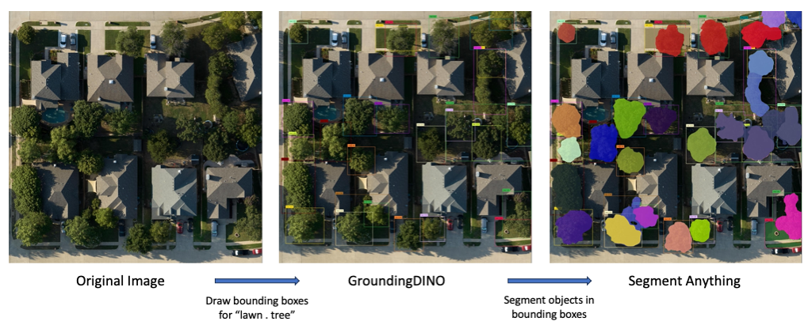
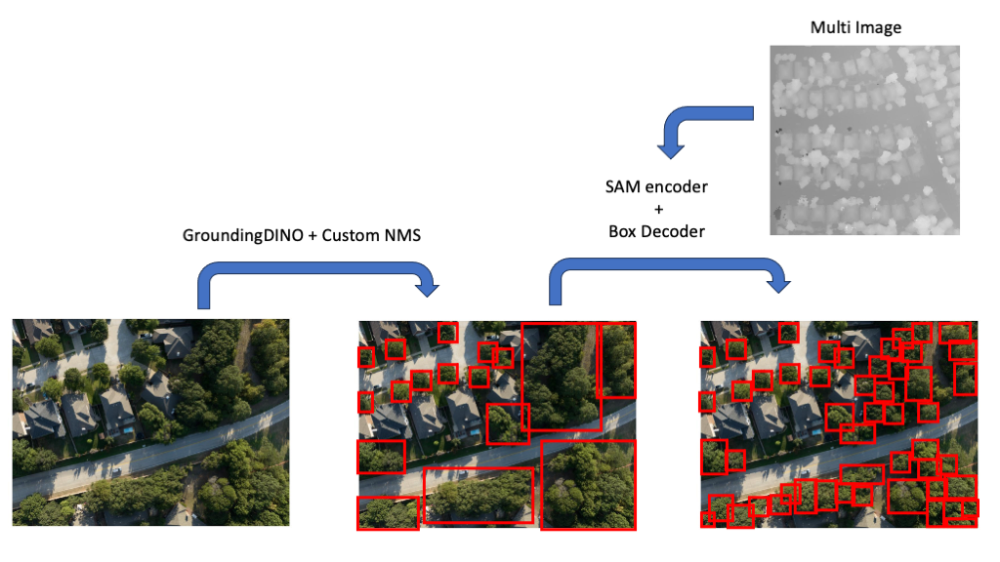

# Tree Detection and Segmentation with GroundingDINO, SAM, and the new Box Decoder

The goal of this project is to detect and ultimately segment individual tree crowns from aerial photographs and orthomosaics. The images are taken by UAV and incorporate RGB, NIR, Red-Edge, and Canopy Height or Digital Surface Models. A number of machine learning models have previously been applied to the same or similar tasks, usually based on Faster R-CNN (for detection) or Mask R-CNN (for segmentation), though occasionally incorporating other models as well, such as DETR. Given that the former two models are already several years old (2015 and 2017 respectively), and newer models have shown impressive performance on open-ended detection and segmentation tasks (i.e. detecting and segmenting objects outside of a narrow range of pretrained object categories), we leverage these newer models to more accurately and more robustly detect and segment individual tree crowns.

Specifically, we use [GroundingDINO](https://arxiv.org/abs/2303.05499) to detect and put bounding boxes around individual trees, and the [Segment Anything Model (SAM)](https://arxiv.org/abs/2304.02643) to mask the specific pixels belonging to tree crowns within those boxes; to see an example of this, see the notebook [Tree Detection and Segmentation](notebooks/Tree_Detection_and_Segmentation.ipynb) (this notebook also includes another detection model, [DeepForest](https://deepforest.readthedocs.io/en/latest/), that we will likely compare our models against). This combination of GroundingDINO and SAM has already seen multiple implementations, including one by the makers of GroundingDINO called [Grounded-Segment-Anything](https://github.com/IDEA-Research/Grounded-Segment-Anything), and shows excellent results on images with clearly separated trees. However it struggles in cases where multiple trees are grouped together with little or no space between their crowns. In these cases, GroundingDINO is prone to under-segmentation, i.e. putting a single bounding box around a group of trees rather than the individual trees within that group, as well as double-detection, i.e. detecting the same tree twice, often because it detects a group of trees and a few individual trees *within* the group simultaneously. To address this, we experimented with Non-Maximum Suppression (NMS), including writing functions for External Box Suppression (EBS) and a custom implementation of Non-Max Suppression that utilizes Intersection over Min Area rather than Intersection over Union (see [NMS and EBS](https://docs.google.com/presentation/d/1IE8CdFJMt3kXp-en5ic22ezSSFqznUxW/edit?usp=drive_link&ouid=106552303987763123522&rtpof=true&sd=true) and [Prompts and EBS](https://docs.google.com/presentation/d/1ZTPuxmEoRdACNqIhqQiUuiniLLlcaPw8/edit?usp=drive_link&ouid=106552303987763123522&rtpof=true&sd=true) for details and [detr/box_ops.py](segment_and_detect_anything/detr/box_ops.py) for code). However, we ultimately decided that the best approach would be to train a new Box Decoder, i.e. a model that takes as input the under-segmented bounding boxes of GroundingDINO and the pretrained image encodings of SAM and outputs fine-grained bounding boxes that more accurately detect individual trees even when there is no visible space between their crowns. These more accurate bounding boxes could then be fed back into SAM to segment the individual tree crowns with its Mask Decoder, or a new Mask Decoder could be trained in conjunction with the Box Decoder.

This repository contains code to implement and train the Box Decoder, as well as for preprocessing image data to more quickly and efficiently train the model. Below, we cover the Box Decoder's place in the overall detection and segmentation pipeline, then the preprocessing for the image data, then the layout of code in this Github repository, and finally how to train the Box Decoder.

## Model Overview
The normal pipeline for GroundingDINO and SAM, as implemented for example in [Grounded-Segment-Anything](https://github.com/IDEA-Research/Grounded-Segment-Anything), is to first feed the image with a text prompt into GroundingDINO, which outputs bounding boxes around all instances of that object. You then feed the same image, now with bounding boxes, into SAM, which outputs a segmentation mask for each bounding box. An example of this is shown below.

In our model pipeline, the image with its text prompt is still fed into GroundingDINO to get the initial bounding boxes (we will call these "prompt bounding boxes" to distinguish them from the more fine-grained bounding boxes we will be outputting later). These prompt bounding boxes are passed through the custom Non-Max Suppression function referenced above and then fed along with the original image into the SAM encoder. An important point here is that SAM consists of multiple parts, including an **Image Encoder**, which takes an RGB image and outputs a vector representation; a **Prompt Encoder**, which takes prompts in the form of bounding boxes (or point coordinates or masks), and outputs a vector representation of these; and a **Mask Decoder**, which takes the vector representations from the image encoder and prompt encoder and outputs masks, generally one per prompt. Similar to the case above, we feed the RGB image into SAM's image encoder and the prompt bounding boxes into its prompt encoder. However, we also feed a second version of the image, called the Multi image containing multispectral and tree height information, into SAM's Image Encoder, getting a second vector representation. We then feed both image vector representations and the prompt vector representation into our new **Box Decoder**, which in contrast to SAM's Mask Decoder will output a set number of bounding boxes per image, and these bounding boxes should more accurately capture the individual trees in the image. A mock-up example is shown below; see [Model Proposal 1](https://docs.google.com/presentation/d/1tbC6FfCw6Pp0wTwrLycnM0lAzoDz5898/edit?usp=drive_link&ouid=106552303987763123522&rtpof=true&sd=true) for a more detailed breakdown.

The Box Decoder is designed to be a lightweight module that can be swapped out with SAM's Mask Decoder without affecting any other part of the GroundingDINO or SAM pipeline. To make it work together with these components, I have had to add some functionality to other parts of SAM's pipeline, but none that affect the core functioning of GroundingDINO or SAM. As a result, we can still use GroundingDINO and SAM to detect and segment objects as before; the Box Decoder simply adds another possible output to this pipeline, outputting fine-grained bounding boxes in place of masks.

## Preprocessing
There are two stages of preprocessing the data needs to go through before training the Box Decoder. The first is taking the raw RGB and Multi channel images and putting them into a format appropriate for the SAM encoder. For RGB images there isn't any additional processing that needs to be done at this stage, but the Multi images require significant preprocessing. Multi images are composed of three channels: Canopy Height Model (CHM), Normalized Difference Vegetation Index (NDVI), and Red-Edge; the Canopy Height Model might also be replaced with a Digital Surface Model (DSM) depending on the dataset. These channels have to be manually selected, put together into an image format, and have their values standardized. For the current dataset we are working with, the [NEON Tree Crowns Dataset](https://github.com/weecology/NeonTreeEvaluation), this is all accomplished using the NEONTreeDataset class in [datasets.py](segment_and_detect_anything/datasets.py); for more detailed exploration of the data and preprocessing steps, see [NEON Tree Evaluation EDA](notebooks/NEON_Tree_Evaluation_EDA.ipynb).

The second stage of preprocessing is taking these images and passing them through GroundingDINO and SAM to get prompt bounding boxes and vector encodings of both the images and prompts. Because we are not changing the weights of either GroundingDINO or the SAM encoders, we can do this ahead of time as a preprocessing step and save time when training the Box Decoder, which only needs the outputs of these earlier models, not the original RGB or Multi images. The notebook [Preprocess NEONTreeDataset for VectorDataset](notebooks/Preprocess_NEONTreeDataset_for_VectorDataset.ipynb) carries out this task, running the RGB and Multi images through GroundingDINO and SAM and saving the resulting vector representations to be fed into a VectorDataset. This VectorDataset (also in [datasets.py](segment_and_detect_anything/datasets.py)) is what is used to train the Box Decoder.

Thus far we have constructed and saved a VectorDataset of the *validation set* of the Neon Tree Crown Dataset. The reason we have done this for the validation set and not the training set is that the validation set is uniformly sized (all RGB images are 400 x 400 while all Multi images are 40 x 40), whereas the training dataset has huge disparaties in image size, ranging from roughly 1,000 x 1,000 to 10,000 x 10,000. While it is technically possible to embed the differently sized training images in a VectorDataset, it's not clear if that would be the best approach, or if we should first crop the larger images into sizes closer to the validation set. Also, the validation set has significantly more images than the training set, nearly 200 vs 16, though the difference in image size and the possibility that the validation set images were cropped from larger images could contribute to this.

When we start using our own annotated data to perform inference or training, we will need to create a new dataset structure similar to the NEONTreeDataset. It can be modeled off of the current NEONTreeDataset code, with just slight changes to accommodate differences in how the images are saved. Once this dataset (and thus the first stage of preprocessing) is complete, it should be possible to feed it directly into a VectorDataset with no additional changes.

## Github Layout
All python files are saved under [segment_and_detect_anything](segment_and_detect_anything); notebooks using these files for preprocessing the data and training the model are saved under [notebooks](notebooks). These notebooks are designed to be run in Google Colab, with access to the shared Google Drive for this project. If you are running the code locally or on another server, you will need to change some of the installation and import statements in the notebooks to run them.

Most of the python files under segment_and_detect_anything are copied or lightly adapted from Meta's [Segment Anything Model](https://github.com/facebookresearch/segment-anything). The main exceptions are [box_decoder.py](segment_and_detect_anything/modeling/box_decoder.py) under modeling, which is where the code for the Box Decoder is saved; [predictor.py](segment_and_detect_anything/predictor.py), which is edited more significantly from its SAM version to incorporate the Box Decoder; [train_box_decoder.py](segment_and_detect_anything/train_box_decoder.py) which is a script used in training the Box Decoder, [datasets.py](segment_and_detect_anything/datasets.py) which is where the code for preprocessing datasets described above is saved; and the files under [detr](segment_and_detect_anything/detr), which is code copied or adapted from Meta's [DETR](https://github.com/facebookresearch/detr), which heavily influenced the Box Decoder design and is utilized within it.

Ideally, to make changes to the model and run different experiments with it, you should only have to edit [box_decoder.py](segment_and_detect_anything/modeling/box_decoder.py) and [train_box_decoder.py](segment_and_detect_anything/train_box_decoder.py) and then run the notebook [Train_Box_Decoder](notebooks/Train_Box_Decoder.ipynb). I've made changes to other files in the repository, but I have tried to keep the code for the Box Decoder as isolated as possible so as to avoid affecting the functionality of other parts of the model, e.g. the Mask Decoder. If you do make changes to other files, especially any files under [modeling](segment_and_detect_anything/modeling) that aren't [box_decoder.py](segment_and_detect_anything/modeling/box_decoder.py), just be careful that they don't negatively affect the functionality of SAM overall.

## Training the Box Decoder
[Train_Box_Decoder](notebooks/Train_Box_Decoder.ipynb) is the notebook set up to train the Box Decoder model, log training performance, and save the trained model. It uses code primarily from [box_decoder.py](segment_and_detect_anything/modeling/box_decoder.py) and [train_box_decoder.py](segment_and_detect_anything/train_box_decoder.py).

However, there is currently a bug somewhere in the training loop, I suspect in [train_box_decoder.py](segment_and_detect_anything/train_box_decoder.py) or else in the notebook itself, that is causing the model to "train" but not consistently drop in loss over the course of multiple epochs or even a single epoch sometimes, meaning it isn't actually learning and improving in performance. I will look into this further.